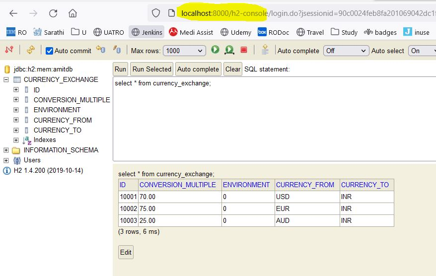

# Currency Exchange Service - JPA and H2

This learning chapter is part of the micro-services-ws-1 workspace.

## Agenda

- [Problem we will solve](#problem-we-will-solve)
- [What you will learn](#what-you-will-learn)
- [How to run](#how-to-run)
- [Example](#example)
- [Key points or common mistakes](#key-points-or-common-mistakes)
- [Chapter summary and next step](#chapter-summary-and-next-step)
- [Common interview questions](#common-interview-questions-and-short-answers)
- [Existing content preserved](#existing-content-preserved)

## Problem We Will Solve

This chapter solves the problem of storing exchange values in a database instead of returning only hard-coded values.

## What You Will Learn

- How Spring Data JPA is added
- How H2 stores sample exchange data
- How repository lookup works for currency pairs

## How To Run

- Run from 06-Currency-exchange-service-configure-jpa: mvn spring-boot:run
- Open http://localhost:8000/currency-exchange-jpa/from/USD/to/INR
- Optional H2 console: http://localhost:8000/h2-console with JDBC URL jdbc:h2:mem:amitdb

## Example

`	ext
GET http://localhost:8000/currency-exchange-jpa/from/EUR/to/INR
`

Use the response to verify the service starts correctly and the configured endpoint is reachable.

## Key Points Or Common Mistakes

- Keep supporting services running when a chapter depends on them.
- Check the configured port before opening the URL.
- Do not change code while testing documentation examples unless the chapter asks for it.

## Chapter Summary And Next Step

This chapter adds one small step in the microservices learning path.
Continue with [07-currency-conversion-service-used-of-resttemplate](../07-currency-conversion-service-used-of-resttemplate/README.md), which solves the next problem in the learning path.

## Common Interview Questions And Short Answers

**Q1. Why use H2 here?**  
It is lightweight and easy for local learning.

**Q2. Where is sample data loaded from?**  
src/main/resources/data.sql.

**Q3. Which endpoint uses JPA?**  
/currency-exchange-jpa/from/{from}/to/{to}.

**Q4. What happens after restart?**  
In-memory H2 data is recreated from data.sql.

**Q5. Why keep the hard-coded endpoint?**  
It allows comparison with database-driven output.

**Q6. What problem comes next?**  
A conversion service needs to call this exchange service.

## Existing Content Preserved

The section below keeps the original README notes from this project so no existing explanation, command, example, or technical detail is lost.

# **Currency Exchange Service with JPA & H2 Database**
---

# H2 Dependency

```xml
<dependency>
    <groupId>com.h2database</groupId>
    <artifactId>h2</artifactId>
</dependency>
```

# 1. What is this?

* This is a **Maven dependency**.
* It tells Maven to include the **H2 database library** in our project.

---

# 2. What is H2?

* H2 is a **lightweight, in-memory database**.
* It is often used for **development, testing, and learning**.
* It does not need separate installation — it runs inside the application.

---

# 3. Why do we use this dependency?

* To connect Spring Boot application with **H2 database**.
* It allows the application to:

  * Create tables.
  * Insert data automatically (`data.sql`).
  * Run queries using JPA/Hibernate.

---

# 4. How does it work?

* When we add this dependency:

  * Spring Boot automatically detects H2.
  * It configures database connection using application.properties.
  * We can open **H2 Console** (web UI) to see data.

---

# 5. Example

* Suppose we add this dependency and run the app.
* In `application.properties` we write:

  ```properties
  spring.h2.console.enabled=true
  spring.datasource.url=jdbc:h2:mem:testdb
  ```
* When the app starts:

  * H2 DB (`testdb`) is created in memory.
  * `data.sql` is executed (tables + data inserted).
  * Access console at: [http://localhost:8080/h2-console](http://localhost:8080/h2-console).

---

# **In short:**
`com.h2database:h2` is required when we want to use **H2 in-memory database** with Spring Boot for quick testing and development.

---
# Currency Exchange Service with JPA & H2 Database
---

# 1. Database Used

* We are using **H2 in-memory database** (data will be deleted on every restart).
* Easy for development and testing.
* Console URL: [http://localhost:8000/h2-console](http://localhost:8000/h2-console)

---

# 2. Configuration (application.properties)

```properties
spring.jpa.show-sql=true
spring.h2.console.enabled=true
spring.datasource.url=jdbc:h2:mem:amitdb
spring.jpa.defer-datasource-initialization=true
```

* `spring.jpa.show-sql=true` → SQL queries will be shown in logs.
* `spring.h2.console.enabled=true` → Enables H2 console access.
* `spring.datasource.url=jdbc:h2:mem:amitdb` → Defines in-memory DB name (`amitdb`).
* `spring.jpa.defer-datasource-initialization=true` → Runs `data.sql` at startup (creates table + inserts data).

---

# 3. Data Initialization

* **File used:** `data.sql`
* Runs automatically when application starts.
* Creates **CURRENCY\_EXCHANGE** table and inserts sample data.
* Example SQL:

```sql
insert into currency_exchange
(id,currency_from,currency_to,conversion_multiple,environment) 
values(10001,'USD','INR',70,'0');

insert into currency_exchange
(id,currency_from,currency_to,conversion_multiple,environment)
values(10002,'EUR','INR',75,'0');

insert into currency_exchange
(id,currency_from,currency_to,conversion_multiple,environment)
values(10003,'AUD','INR',25,'0');
```



---

# 4. REST Endpoints

1. **Hard-coded response**

   * URL: [http://localhost:8000/currency-exchange-hard-coded/from/USD/to/INR](http://localhost:8000/currency-exchange-hard-coded/from/USD/to/INR)
   * Returns fixed values (not from DB).

   **Example Response:**

   ```json
   {
     "id": 1001,
     "from": "USD",
     "to": "INR",
     "conversionMultiple": 82,
     "environment": "8000"
   }
   ```

2. # **JPA-based response**

   * URL: [http://localhost:8000/currency-exchange-jpa/from/USD/to/INR](http://localhost:8000/currency-exchange-jpa/from/USD/to/INR)
   * Reads data from **H2 database**.
   * Supports multiple queries:

     * `/from/USD/to/INR`
     * `/from/EUR/to/INR`
     * `/from/AUD/to/INR`

   **Example Response from DB:**

   ```json
   {
     "id": 1002,
     "from": "EUR",
     "to": "INR",
     "conversionMultiple": 90,
     "environment": "8000"
   }
   ```
# **Access URL**
```
http://localhost:8000/currency-exchange-hard-coded/from/USD/to/INR  
http://localhost:8000/currency-exchange-jpa/from/USD/to/INR  
http://localhost:8000/currency-exchange-jpa/from/EUR/to/INR  
http://localhost:8000/currency-exchange-jpa/from/AUD/to/INR  
```
---

# 5. Key Points

* Each restart wipes out existing data (in-memory database).
* Useful for **testing microservices**.
* Can later be connected to **Oracle DB** by changing properties:

  ```properties
  spring.datasource.url=jdbc:oracle:thin:@localhost:1521:XE
  spring.datasource.username=system
  spring.datasource.password=system
  spring.datasource.driver-class-name=oracle.jdbc.driver.OracleDriver
  spring.datasource.platform=oracle
  ```
---
# **Example Use Case:**

* If a client requests currency conversion `USD → INR`, service fetches conversion multiple (e.g., `82`) from H2 DB and returns result.
* In real-world, this can be extended to fetch from Oracle or MySQL instead of H2.
---
